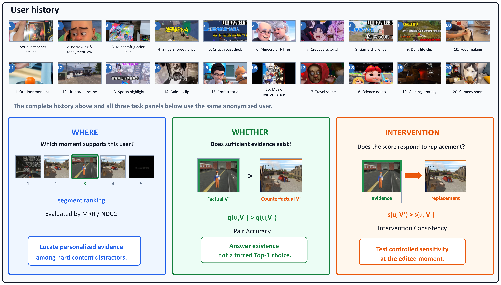
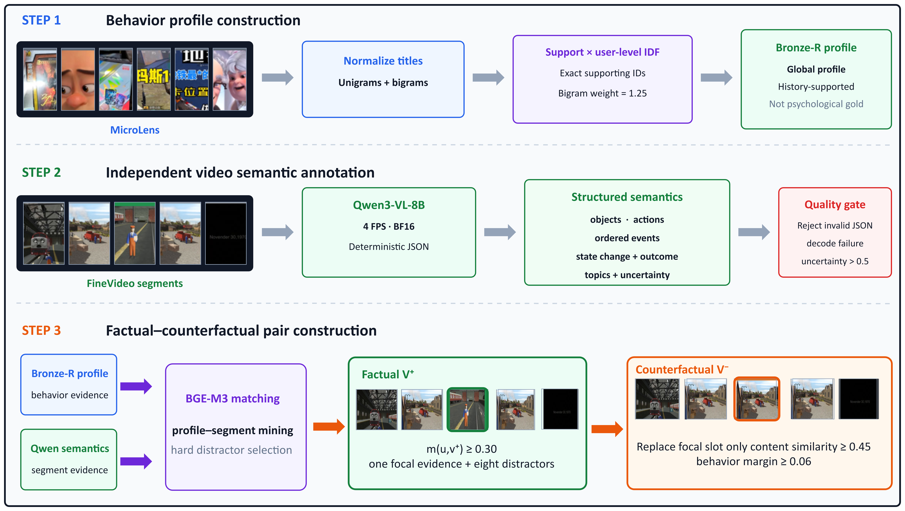

# CBGER

Official release package for:

> **Does This Moment Justify the Recommendation? Counterfactual Behavior-Grounded Evidence Retrieval for Personalized Video Recommendation**

CBGER studies whether a candidate video contains a moment that genuinely supports a recommendation for a user's observed behavior history. It separates three questions:

- **Where:** which segment is the behavior-grounded evidence?
- **Whether:** does sufficient personalized evidence exist at the video level?
- **Intervention:** does the score decrease when the focal evidence is replaced?

The repository includes the frozen **CBGER-10K** benchmark, CLIP features, three released CBGER checkpoints, exact result files, construction scripts, training/evaluation code, and baseline adapters.



## Headline results

Results are mean ± sample standard deviation over seeds `20260831`, `20260832`, and `20260833`.

| Method | MRR | NDCG@1 | NDCG@3 | NDCG@5 | PairAcc | Intervention |
|---|---:|---:|---:|---:|---:|---:|
| Frozen CLIP similarity | .4127±.0000 | .2060±.0000 | .3588±.0000 | .4461±.0000 | .6320±.0000 | .6320±.0000 |
| PR-Net | .3850±.0047 | .1627±.0098 | .3368±.0130 | .4271±.0151 | .5810±.0436 | .6233±.0150 |
| QD-DETR | .4231±.0011 | .2063±.0051 | .3784±.0018 | .4662±.0016 | .5873±.0080 | .6517±.0210 |
| TR-DETR | .4125±.0236 | .2043±.0154 | .3630±.0357 | .4501±.0380 | .6320±.0212 | .6527±.0202 |
| FlashVTG | .4154±.0061 | .2013±.0099 | .3736±.0081 | .4549±.0060 | .6207±.0153 | .6327±.0029 |
| MQVTG | .4112±.0137 | .1940±.0148 | .3624±.0146 | .4552±.0223 | .6073±.0257 | .6380±.0118 |
| **CBGER** | **.4432±.0122** | **.2363±.0099** | **.4008±.0187** | **.4901±.0133** | **.6977±.0070** | **.6987±.0035** |

The complete machine-readable table and bootstrap tests are in [`results/main/table2_main_results.json`](results/main/table2_main_results.json).

## Repository layout

```text
CBGER/
├── assets/                  # Paper-ready figures
├── checkpoints/             # Three released CBGER checkpoints
├── configs/                 # Final experiment configuration
├── data/
│   ├── cbger10k/             # 10,000 frozen records + user profiles
│   └── features/             # Frozen CLIP ViT-B/32 segment features
├── docs/                    # Data card and reproduction notes
├── paper/                   # Final paper PDF
├── results/                 # Main, baseline and ablation results
├── scripts/
│   ├── data/                # Automated benchmark construction
│   ├── train/               # CBGER training
│   ├── eval/                # Where/Whether/Intervention evaluation
│   └── baselines/           # Baseline adapters and launcher
├── src/cbger/               # Model and loss implementation
└── tests/                   # Structural validation
```

## Installation

Tested in WSL2 Ubuntu 24.04 with one RTX 4090 (24 GB).

```bash
conda env create -f environment.yml
conda activate cbger
pip install -e .[vision,dev]
```

For the exact original package snapshot, use `requirements-lock.txt`. See [`docs/runtime_snapshot.txt`](docs/runtime_snapshot.txt) before attempting a bit-for-bit environment recreation.

## Verify the released benchmark

```bash
pytest -q
python scripts/data/validate_cbger10k.py
sha256sum -c checksums.sha256
```

Expected benchmark statistics:

| Split | Factual | Counterfactual | Total records |
|---|---:|---:|---:|
| Train | 3,500 | 3,500 | 7,000 |
| Validation | 500 | 500 | 1,000 |
| Test | 1,000 | 1,000 | 2,000 |
| **Total** | **5,000** | **5,000** | **10,000** |

There are 3,026 unique users. Every record has a nine-segment timeline. Each factual record has one focal evidence segment and eight hard distractors; its matched counterfactual replaces only the focal slot.

## Reproduce CBGER

Run all three released seeds:

```bash
bash scripts/run_cbger_3seeds.sh
```

Outputs are written under `outputs/cbger/`. The final video-level Whether score is the arithmetic mean of the nine segment scores:

```text
q_mean(u, V) = (1/N) * sum_i s_i
```

To evaluate an existing predictions file:

```bash
PYTHONPATH=src python scripts/eval/evaluate_cbger.py \
  --dataset data/cbger10k/cbger10k.jsonl \
  --predictions outputs/cbger/predictions/seed_20260831.jsonl \
  --aggregation mean \
  --output outputs/cbger/metrics/seed_20260831.json
```

## Reproduce CBGER-10K construction

The released JSONL is already frozen. Rebuilding from source requires the MicroLens metadata/history files and FineVideo media/interval metadata under their original licenses. The automated pipeline is:

1. derive history-supported Bronze-R profiles from MicroLens titles;
2. annotate eligible FineVideo intervals with Qwen3-VL-8B at 4 FPS, BF16, deterministic decoding;
3. serialize structured semantics (objects, actions, ordered events, state changes, outcomes, topics, uncertainty);
4. independently match profiles to segment semantics with BGE-M3;
5. mine one factual evidence segment, eight content-hard distractors, and one behavior-weaker content neighbor;
6. build a single-slot factual/counterfactual pair and freeze splits, links, intervals, seeds and hashes.

Detailed paths, schemas, thresholds and commands are in [`docs/DATASET.md`](docs/DATASET.md).



## Baselines

The release adapts Frozen CLIP, PR-Net, QD-DETR, TR-DETR, FlashVTG and MQVTG to the same frozen splits and features. Upstream repositories are not redistributed. Setup and exact commands are documented in [`docs/BASELINES.md`](docs/BASELINES.md).

## Data and licensing

CBGER-10K contains derived metadata, virtual timelines and frozen features. It does not redistribute full MicroLens or FineVideo source videos. Source identifiers and temporal intervals are retained for provenance. Before publishing the repository, confirm redistribution permissions and select a code/data license; see [`docs/RELEASE_CHECKLIST.md`](docs/RELEASE_CHECKLIST.md).

## Citation

```bibtex
@misc{cbger,
  title={Does This Moment Justify the Recommendation? Counterfactual Behavior-Grounded Evidence Retrieval for Personalized Video Recommendation},
  author={{CBGER Authors}},
  note={CBGER code and CBGER-10K benchmark release}
}
```
